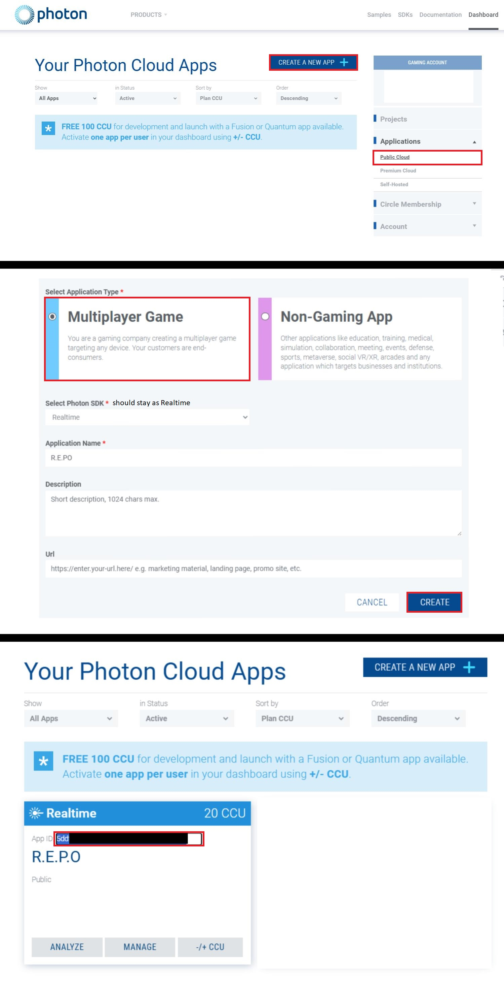

# **BepInEx PhotonRedir**

## **Installation**
1. Download the latest release from [Releases](https://github.com/awc21/BepInEx-PhotonRedir/releases/latest).
2. Place the downloaded **DLL** into the `BepInEx/plugins` folder.
3. Run the game once, in order to generate `photon-redirect.cfg`
4. Open `BepInEx/config/photon-redirect.cfg` and set your **PhotonAppId**.

## **Getting Photon AppID**
1. Go to [Photon Engine](https://www.photonengine.com/).
2. Sign up or log in to your account.
3. Navigate to the [Photon Dashboard](https://dashboard.photonengine.com/).
4. 
5. Copy the **App ID** and use it in `photon-redirect.cfg`.

## Notes
- Installing **BepinEx**: [Video](https://www.youtube.com/watch?v=Pe4ZNLyoEpw&t=35) (x2 speed)
- if youre using **R.E.P.O** build from [OFME](https://online-fix.me), modify your `dlllist.txt` after installing **BepInEx**
```
SteamOverlay64.dll
Onlinefix64.dll
MonoBleedingEdge\EmbedRuntime\mono-2.0-bdwgc.dll
REPO_Data\Managed\PhotonRealtime.net.org
winhttp.dll
```

---

## **Building from source**

### **Requirements**
- [.NET SDK](https://dotnet.microsoft.com/en-us/download)

### **Steps**
   ```
   git clone https://github.com/awc21/BepInEx-PhotonRedir.git
   cd BepInEx-PhotonRedir\src\main
   dotnet build -c release -o out
   ```
   
# Disclaimer
This software is provided "as is", without warranty of any kind, express or implied.  
The author is not responsible for any damages, data loss, or other issues that may arise from using this project.  
Use at your own risk.
